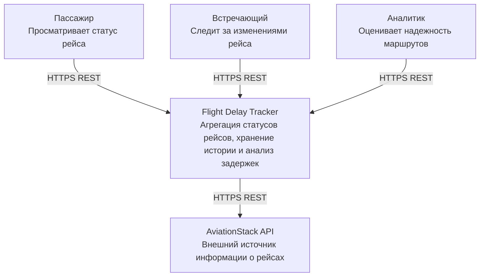
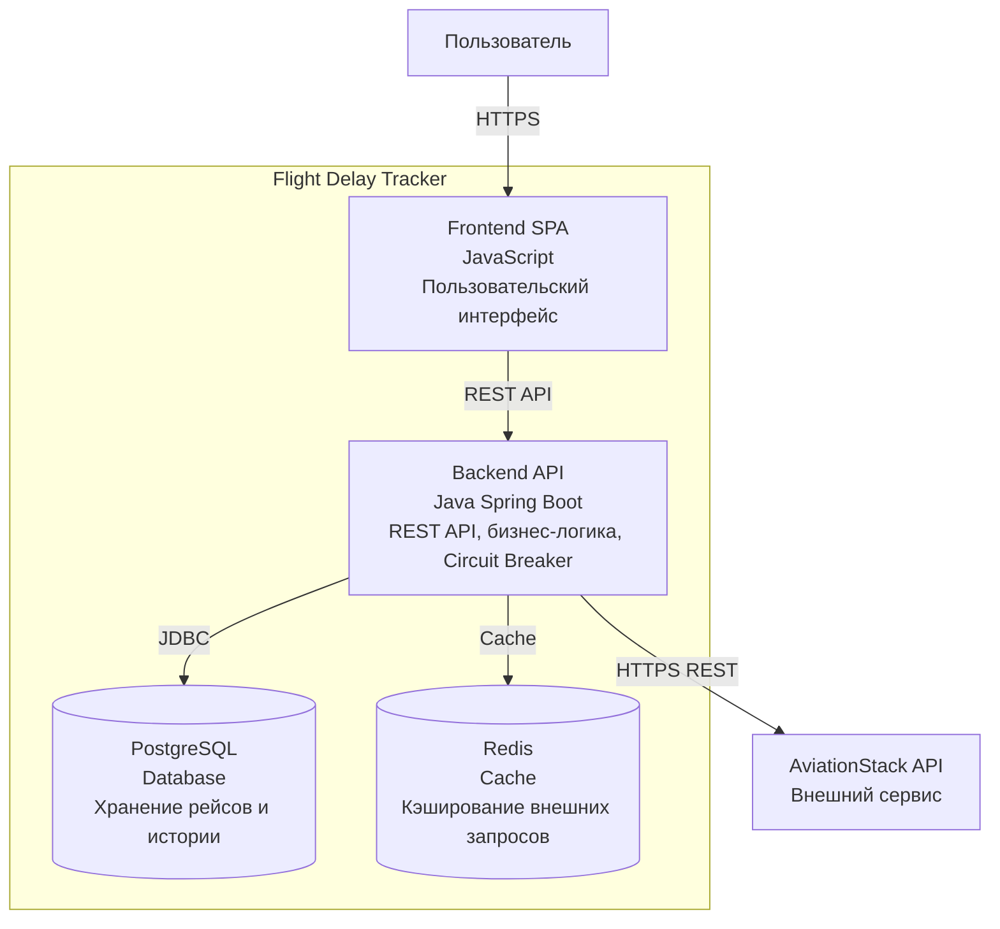
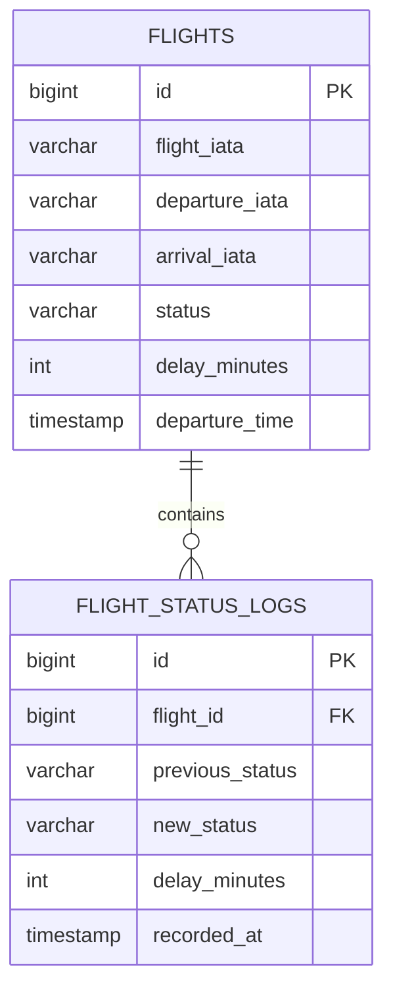

# Этап 3. Архитектура и детальное проектирование

## 1. Capacity Planning
## 1.1 Расчет нагрузки
- Текущая нагрузка: RPSavg ≈ 1 req/sec
- Пиковая нагрузка: При масштабировании до 100 000 пользователей в сутки: 5 req/sec × 10 = 50 req/sec
- С учетом неравномерности активности: 50 × 3 = 150 req/sec
- Итог: Пиковая нагрузка при масштабировании: ≈150 запросов/сек

------------------------------------------------------------------------

## 1.2 Read/Write нагрузка
  Тип операции                 Доля
  ---------------------------- ------
  Получение статуса рейса      70%
  Получение истории            20%
  Расчет рейтинга надежности   5%
  Обновление данных            5%

Итог: Read : Write = 95 : 5 ≈ 19 : 1

------------------------------------------------------------------------

# 1.3 Расчет сетевого трафика
- Средний размер ответа: FlightResponseDto ≈ 500-600 байт
- Текущая нагрузка: 5 req/sec × 600 байт ≈ 3 КБ/сек
- При 100 000 пользователей: 150 req/sec × 600 байт ≈ 90 КБ/сек
- Суточный объем: 90 KB × 86400 ≈ 7.8 GB/day
- Redis Cache уменьшает количество запросов к внешнему AviationStack API.

------------------------------------------------------------------------

# 1.4 Расчет дисковой системы (\>5 лет)
Основная историческая таблица: flight_status_logs

Предположения:
- 10 000 активных рейсов в сутки;
- обновление статуса каждые 15 минут;
- 96 обновлений одного рейса в сутки.

Количество записей: 10000 × 96 = 960000 записей/сутки

Размер записи: ≈300 байт

За 5 лет: 288 MB × 365 × 5 ≈ 525 GB

С учетом индексов, WAL и резервного копирования: ≈1 TB

------------------------------------------------------------------------

# 2. C4 Model
Диаграммы представлены в нотации C4 (Context / Container level) с использованием синтаксиса Mermaid `flowchart`, так как плагин `C4Context`/`C4Container` не рендерится стабильно в предпросмотре GitHub.

## Context Diagram


------------------------------------------------------------------------

## Container Diagram


------------------------------------------------------------------------

# 3. API Contracts
## Получение активных рейсов
GET /api/v1/flights/active

Latency: p95 < 300 ms

------------------------------------------------------------------------

## Получение статуса рейса
GET /api/v1/flights/{flightIata}

Порядок получения:
    Redis Cache
          |
          v
    PostgreSQL
          |
          v
    AviationStack API

Latency:
Cache hit: <300 ms
External API: <1.5 sec

------------------------------------------------------------------------

## Получение истории рейса
GET /api/v1/flights/{flightIata}/history

Latency: p95 < 500 ms

------------------------------------------------------------------------

# 4. Нефункциональные требования
## Производительность
-   p95 latency основных GET запросов \<300 мс;
-   поддержка нагрузки до 150 RPS.

## Масштабируемость
Поддержка: 100 000 пользователей/сутки

за счет:
-   горизонтального масштабирования backend;
-   Redis Cache;
-   PostgreSQL Read Replica.

## Доступность
Availability ≥99.5%

## Отказоустойчивость
Используются:
-   Circuit Breaker;
-   fallback;
-   последние сохраненные данные.

------------------------------------------------------------------------

# 5. Проектирование данных
## ER Diagram


------------------------------------------------------------------------

# 5.1 Индексы базы данных
## Поиск рейса

```sql
CREATE INDEX idx_flights_iata
ON flights(flight_iata);
```
Ускоряет поиск рейса по номеру.

------------------------------------------------------------------------

## Получение истории

```sql
CREATE INDEX idx_status_logs_flight_time
ON flight_status_logs(
flight_id,
recorded_at DESC
);
```
Ускоряет получение истории рейса.

------------------------------------------------------------------------

## Расчет рейтинга

```sql
CREATE INDEX idx_status_logs_status
ON flight_status_logs(
flight_id,
new_status
);
```
Ускоряет агрегирующие запросы.

------------------------------------------------------------------------

# 6. Рейтинг надежности
Используемые метрики:
-   onTimeRate;
-   averageDelay;
-   cancellationRate.

Формула:
    score =
    clamp(
    100 -
    avg_delay_minutes * 0.5 -
    cancellation_rate * 100 * 2,
    0,
    100
    )

Расчет выполняется на основе: flight_status_logs

------------------------------------------------------------------------

# 7. Масштабирование до 100 000 пользователей
## Backend
Используется горизонтальное масштабирование:

                 Load Balancer

                      |

           ----------------------

           |          |          |

         API 1      API 2      API 3

------------------------------------------------------------------------

## PostgreSQL
    Primary DB

         |

    -----------------

    |       |        |

    Read1  Read2   Read3

Primary используется для записи, реплики --- для чтения.

------------------------------------------------------------------------

## Redis Cache
Кэшируются:
-   статусы рейсов;
-   ответы AviationStack API.
TTL: 3 минуты
Для исторических данных: до 1 часа

------------------------------------------------------------------------

## Защита внешнего API
Алгоритм:
1.  Проверить данные в Redis.
2.  Если данные есть --- вернуть из кэша.
3.  Если данных нет --- запросить AviationStack.
4.  Сохранить результат.
5.  Вернуть пользователю.
