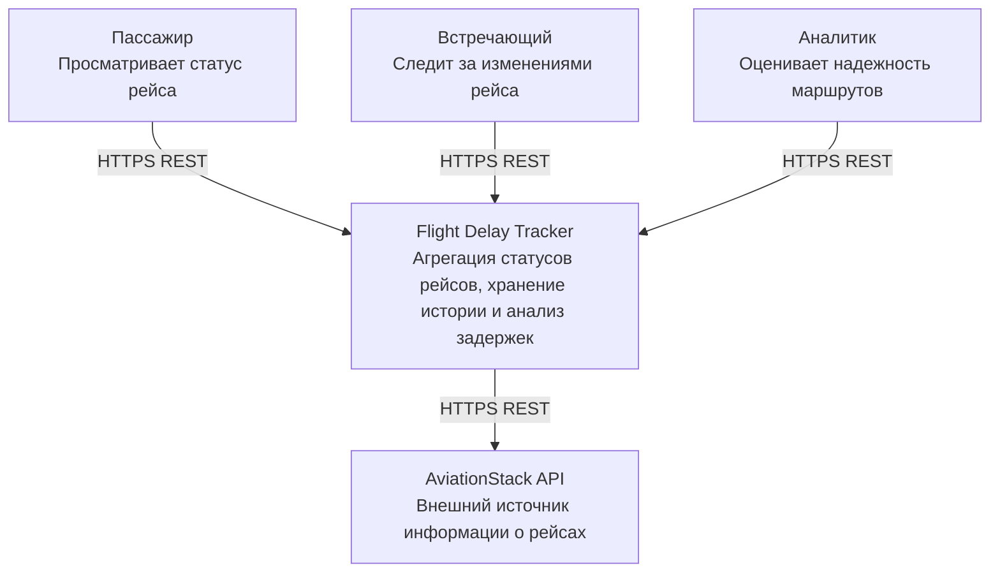
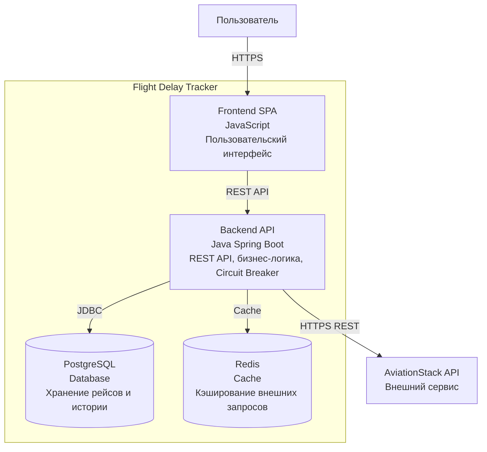

# Этап 3. Архитектура и детальное проектирование

## 1. Capacity Planning
## 1.1 Расчет нагрузки
- Текущая нагрузка: RPSavg ≈ 1 req/sec
- Пиковая нагрузка: При масштабировании до 100 000 пользователей в сутки: 5 req/sec × 10 = 50 req/sec
- С учетом неравномерности активности: 50 × 3 = 150 req/sec
- Итог: Пиковая нагрузка при масштабировании: ≈150 запросов/сек

------------------------------------------------------------------------

## 1.2 Read/Write нагрузка
  Тип операции                 Доля
  ---------------------------- ------
  Получение статуса рейса      70%
  Получение истории            20%
  Расчет рейтинга надежности   5%
  Обновление данных            5%

<<<<<<< HEAD
## Этап 2. Пользовательские сценарии и расчет нагрузок
### Пользовательские сценарии (User Stories)
1. **US-1 (Пассажир):** Как авиапассажир, я хочу ввести номер рейса (например, `SU-100`) и дату, чтобы получить актуальный статус вылета, терминал, гейт и расчетное время задержки.
=======
Итог: Read : Write = 95 : 5 ≈ 19 : 1

------------------------------------------------------------------------
>>>>>>> f065fa5d1b4452f42aa0055a9fa6c5f058d3ab3d

# 1.3 Расчет сетевого трафика
- Средний размер ответа: FlightResponseDto ≈ 500-600 байт
- Текущая нагрузка: 5 req/sec × 600 байт ≈ 3 КБ/сек
- При 100 000 пользователей: 150 req/sec × 600 байт ≈ 90 КБ/сек
- Суточный объем: 90 KB × 86400 ≈ 7.8 GB/day
- Redis Cache уменьшает количество запросов к внешнему AviationStack API.

------------------------------------------------------------------------

# 1.4 Расчет дисковой системы (\>5 лет)
Основная историческая таблица: flight_status_logs

Предположения:
- 10 000 активных рейсов в сутки;
- обновление статуса каждые 15 минут;
- 96 обновлений одного рейса в сутки.

Количество записей: 10000 × 96 = 960000 записей/сутки

<<<<<<< HEAD
### Расчет нагрузок (Capacity Planning)
#### 1. Исходные параметры
* **Целевая аудитория (DAU):** $10\,000$ активных пользователей в сутки.
* **Средняя активность:** 1 пользователь совершает в среднем 8 запросов на чтение (просмотр табло, поиск рейса) и 0.5 запросов на запись (создание подписки на рейс).
* **Суточный объем запросов:**
  * Запросы на чтение (Read): $10\,000 \times 8 = 80\,000$ запросов/сутки.
  * Запросы на запись (Write): $10\,000 \times 0.5 = 5\,000$ запросов/сутки.
  * Фоновые синхронизации с внешним API: $1\,000$ отслеживаемых рейсов $\times 4$ обновления/час $\times 24 = 96\,000$ запросов/сутки.
  * Всего входящих HTTP-запросов к API: $85\,000$ запросов/сутки.
=======
Размер записи: ≈300 байт

За 5 лет: 288 MB × 365 × 5 ≈ 525 GB

С учетом индексов, WAL и резервного копирования: ≈1 TB
>>>>>>> f065fa5d1b4452f42aa0055a9fa6c5f058d3ab3d

------------------------------------------------------------------------

# 2. C4 Model
Диаграммы представлены в нотации C4 (Context / Container level) с использованием синтаксиса Mermaid `flowchart`, так как плагин `C4Context`/`C4Container` не рендерится стабильно в предпросмотре GitHub.

## Context Diagram


------------------------------------------------------------------------

<<<<<<< HEAD
#### 4. Расчет оперативной памяти под кэш (Redis)
* **Стратегия кэширования:** кэшируются метаданные только активных суточных рейсов ($1\,000$ рейсов).
* **Размер JSON-структуры рейса:** $\approx 2$ КБ.
* **TTL ключа:** 180 секунд (3 минуты).
* **Объем активного кэша данных:**
  $$1\,000 \times 2\text{ КБ} = 2\,000\text{ КБ} \approx 2\text{ МБ}$$
* **Накладные расходы Redis:** под структуры данных, ключи поиска по аэропортам и сессии выделяется **$64 - 128\text{ МБ}$ RAM**, что с запасом перекрывает пиковые всплески.

---

# Этап 3. Архитектура и детальное проектирование

## 1. Capacity Planning
## 1.1 Расчет нагрузки
- Текущая нагрузка: RPSavg ≈ 1 req/sec
- Пиковая нагрузка: При масштабировании до 100 000 пользователей в сутки: 5 req/sec × 10 = 50 req/sec
- С учетом неравномерности активности: 50 × 3 = 150 req/sec
- Итог: Пиковая нагрузка при масштабировании: ≈150 запросов/сек

## 1.2 Read/Write нагрузка
  Тип операции                 Доля
  ---------------------------- ------
  Получение статуса рейса      70%
  Получение истории            20%
  Расчет рейтинга надежности   5%
  Обновление данных            5%

Итог: Read : Write = 95 : 5 ≈ 19 : 1

# 1.3 Расчет сетевого трафика
- Средний размер ответа: FlightResponseDto ≈ 500-600 байт
- Текущая нагрузка: 5 req/sec × 600 байт ≈ 3 КБ/сек
- При 100 000 пользователей: 150 req/sec × 600 байт ≈ 90 КБ/сек
- Суточный объем: 90 KB × 86400 ≈ 7.8 GB/day
- Redis Cache уменьшает количество запросов к внешнему AviationStack API.

# 1.4 Расчет дисковой системы (\>5 лет)
Основная историческая таблица: flight_status_logs

Предположения:
- 10 000 активных рейсов в сутки;
- обновление статуса каждые 15 минут;
- 96 обновлений одного рейса в сутки.

Количество записей: 10000 × 96 = 960000 записей/сутки

Размер записи: ≈300 байт

За 5 лет: 288 MB × 365 × 5 ≈ 525 GB

С учетом индексов, WAL и резервного копирования: ≈1 TB

# 2. C4 Model
## Context Diagram
``` mermaid
C4Context

Person(passenger, "Пассажир", "Просматривает статус рейса")
Person(greeter, "Встречающий", "Следит за изменениями рейса")
Person(analyst, "Аналитик", "Оценивает надежность маршрутов")

System(tracker, "Flight Delay Tracker",
"Агрегация статусов рейсов, хранение истории и анализ задержек")

System_Ext(api, "AviationStack API",
"Внешний источник информации о рейсах")

Rel(passenger, tracker, "Запрашивает данные", "HTTPS REST")
Rel(greeter, tracker, "Получает изменения", "HTTPS REST")
Rel(analyst, tracker, "Получает статистику", "HTTPS REST")
Rel(tracker, api, "Получает данные рейсов", "HTTPS REST")
```

## Container Diagram
``` mermaid
C4Container

Person(user, "Пользователь")

System_Boundary(system, "Flight Delay Tracker") {

Container(frontend,
"Frontend SPA",
"JavaScript",
"Пользовательский интерфейс")

Container(backend,
"Backend API",
"Java Spring Boot",
"REST API, бизнес-логика, Circuit Breaker")

ContainerDb(postgres,
"PostgreSQL",
"Database",
"Хранение рейсов и истории")

ContainerDb(redis,
"Redis",
"Cache",
"Кэширование внешних запросов")

}

System_Ext(api,
"AviationStack API",
"Внешний сервис")

Rel(user, frontend, "HTTPS")
Rel(frontend, backend, "REST API")
Rel(backend, postgres, "JDBC")
Rel(backend, redis, "Cache")
Rel(backend, api, "HTTPS REST")
```

=======
## Container Diagram


------------------------------------------------------------------------

>>>>>>> f065fa5d1b4452f42aa0055a9fa6c5f058d3ab3d
# 3. API Contracts
## Получение активных рейсов
GET /api/v1/flights/active

Latency: p95 < 300 ms

<<<<<<< HEAD
=======
------------------------------------------------------------------------

>>>>>>> f065fa5d1b4452f42aa0055a9fa6c5f058d3ab3d
## Получение статуса рейса
GET /api/v1/flights/{flightIata}

Порядок получения:
    Redis Cache
          |
          v
    PostgreSQL
          |
          v
    AviationStack API

Latency:
Cache hit: <300 ms
External API: <1.5 sec

<<<<<<< HEAD
=======
------------------------------------------------------------------------

>>>>>>> f065fa5d1b4452f42aa0055a9fa6c5f058d3ab3d
## Получение истории рейса
GET /api/v1/flights/{flightIata}/history

Latency: p95 < 500 ms

<<<<<<< HEAD
=======
------------------------------------------------------------------------

>>>>>>> f065fa5d1b4452f42aa0055a9fa6c5f058d3ab3d
# 4. Нефункциональные требования
## Производительность
-   p95 latency основных GET запросов \<300 мс;
-   поддержка нагрузки до 150 RPS.

## Масштабируемость
Поддержка: 100 000 пользователей/сутки

за счет:
-   горизонтального масштабирования backend;
-   Redis Cache;
-   PostgreSQL Read Replica.

## Доступность
Availability ≥99.5%

## Отказоустойчивость
Используются:
-   Circuit Breaker;
-   fallback;
-   последние сохраненные данные.

<<<<<<< HEAD
# 5. Проектирование данных
## ER Diagram
``` mermaid
=======
------------------------------------------------------------------------

# 5. Проектирование данных
## ER Diagram
```mermaid
>>>>>>> f065fa5d1b4452f42aa0055a9fa6c5f058d3ab3d
erDiagram

FLIGHTS ||--o{ FLIGHT_STATUS_LOGS : contains

FLIGHTS {
bigint id PK
varchar flight_iata
varchar departure_iata
varchar arrival_iata
varchar status
int delay_minutes
timestamp departure_time
}

FLIGHT_STATUS_LOGS {
bigint id PK
bigint flight_id FK
varchar previous_status
varchar new_status
int delay_minutes
timestamp recorded_at
}
```

<<<<<<< HEAD
# 5.1 Индексы базы данных
## Поиск рейса

``` sql
=======
------------------------------------------------------------------------

# 5.1 Индексы базы данных
## Поиск рейса

```sql
>>>>>>> f065fa5d1b4452f42aa0055a9fa6c5f058d3ab3d
CREATE INDEX idx_flights_iata
ON flights(flight_iata);
```
Ускоряет поиск рейса по номеру.

<<<<<<< HEAD
## Получение истории

``` sql
=======
------------------------------------------------------------------------

## Получение истории

```sql
>>>>>>> f065fa5d1b4452f42aa0055a9fa6c5f058d3ab3d
CREATE INDEX idx_status_logs_flight_time
ON flight_status_logs(
flight_id,
recorded_at DESC
);
```
Ускоряет получение истории рейса.

<<<<<<< HEAD
## Расчет рейтинга

``` sql
=======
------------------------------------------------------------------------

## Расчет рейтинга

```sql
>>>>>>> f065fa5d1b4452f42aa0055a9fa6c5f058d3ab3d
CREATE INDEX idx_status_logs_status
ON flight_status_logs(
flight_id,
new_status
);
```
Ускоряет агрегирующие запросы.

<<<<<<< HEAD
=======
------------------------------------------------------------------------

>>>>>>> f065fa5d1b4452f42aa0055a9fa6c5f058d3ab3d
# 6. Рейтинг надежности
Используемые метрики:
-   onTimeRate;
-   averageDelay;
-   cancellationRate.

Формула:
    score =
    clamp(
    100 -
    avg_delay_minutes * 0.5 -
    cancellation_rate * 100 * 2,
    0,
    100
    )

Расчет выполняется на основе: flight_status_logs

<<<<<<< HEAD
=======
------------------------------------------------------------------------

>>>>>>> f065fa5d1b4452f42aa0055a9fa6c5f058d3ab3d
# 7. Масштабирование до 100 000 пользователей
## Backend
Используется горизонтальное масштабирование:

                 Load Balancer

                      |

           ----------------------

           |          |          |

         API 1      API 2      API 3

<<<<<<< HEAD
=======
------------------------------------------------------------------------

>>>>>>> f065fa5d1b4452f42aa0055a9fa6c5f058d3ab3d
## PostgreSQL
    Primary DB

         |

    -----------------

    |       |        |

    Read1  Read2   Read3

Primary используется для записи, реплики --- для чтения.

<<<<<<< HEAD
=======
------------------------------------------------------------------------

>>>>>>> f065fa5d1b4452f42aa0055a9fa6c5f058d3ab3d
## Redis Cache
Кэшируются:
-   статусы рейсов;
-   ответы AviationStack API.
TTL: 3 минуты
Для исторических данных: до 1 часа

<<<<<<< HEAD
=======
------------------------------------------------------------------------

>>>>>>> f065fa5d1b4452f42aa0055a9fa6c5f058d3ab3d
## Защита внешнего API
Алгоритм:
1.  Проверить данные в Redis.
2.  Если данные есть --- вернуть из кэша.
3.  Если данных нет --- запросить AviationStack.
4.  Сохранить результат.
5.  Вернуть пользователю.
<<<<<<< HEAD

---
=======
>>>>>>> f065fa5d1b4452f42aa0055a9fa6c5f058d3ab3d
